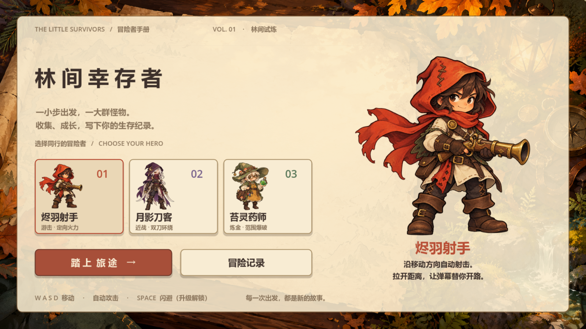
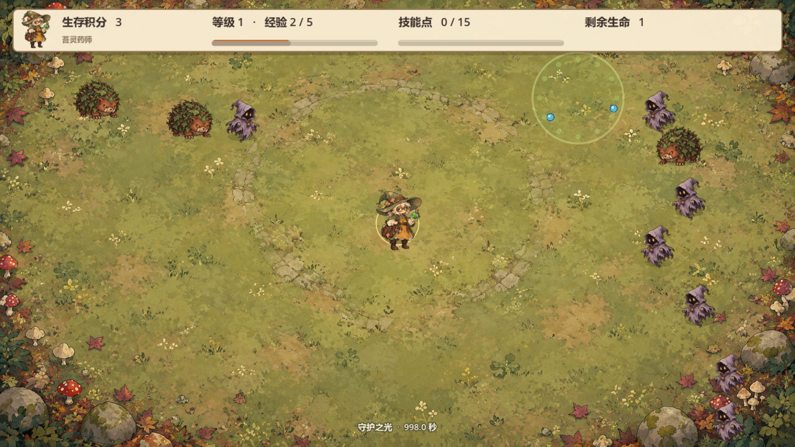
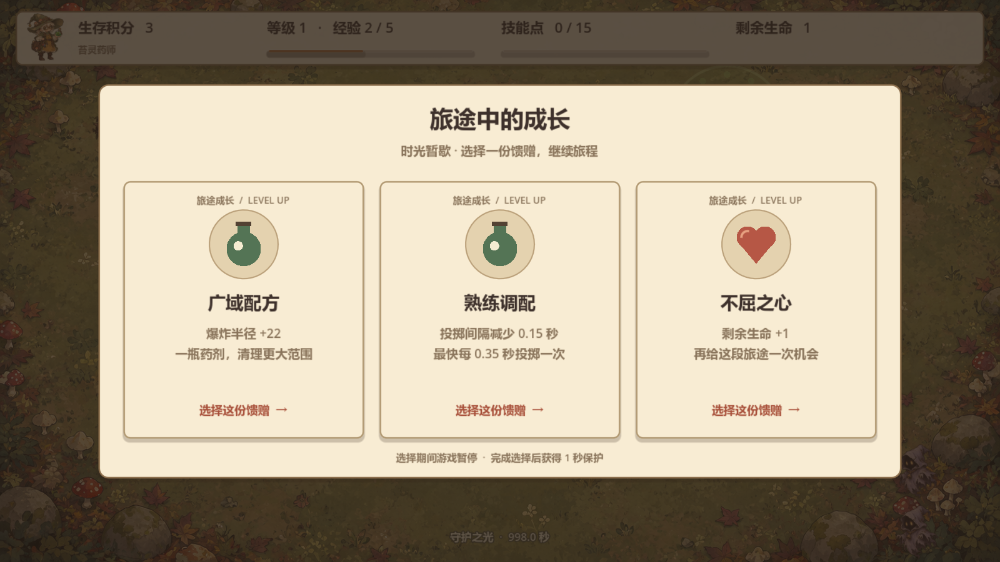

# 林间幸存者 · Dodge the Creeps

使用 Godot 4 制作的手绘奇幻风类幸存者小游戏。三位冒险者分别使用火铳、环绕月刃和范围药剂，在林间试炼中收集经验与蓝色技能球。



## 游戏玩法

控制英雄移动，躲避不断出现的敌人并自动攻击。击杀敌人可以获得普通经验和蓝色技能点，升级时从三个随机选项中选择一个。

## 英雄

- **英雄 1 · 烬羽射手**：红围巾与火铳。沿移动方向自动射击；普通升级增加正面子弹或弹速；技能点增加身后子弹，或强化下一次弹速升级。
- **英雄 2 · 月影刀客**：紫披风与银色月刃。初始两把环绕刀；普通升级增加刀环距离或转速；技能点可增加一把刀，或强化下一次距离 / 转速升级。所有刀刃均匀分布，避免互相重叠。
- **英雄 3 · 苔灵药师**：绿帽、护目镜与药瓶。自动向附近敌人投掷药剂，落地范围爆炸；普通升级增加爆炸半径或缩短投掷间隔；技能点可增加药瓶数量，或让下一次对应升级翻倍。

三位英雄都拥有移动速度、身体缩小、额外生命和闪避等通用升级。普通升级和技能升级各自随机提供三个选项；翻倍祝福只消耗在下一次对应普通升级中。



## 游戏系统

- 开始时有 3 秒保护时间，升级选择完成后有 1 秒保护时间。
- 击杀敌人会掉落蓝色技能球，收集后可触发技能点升级。
- 开始界面提供英雄选择和排行榜。
- 排行榜会保存最高 10 局成绩，记录保存在 Godot 的 `user://leaderboard.json`。
- 技能升级需求依次为 15、30、45……个技能点；升级消耗对应数量。
- 战斗区域为 **1600×900**，窗口默认同尺寸；界面独立等比适配。
- 怪物使用蘑菇怪、荆棘兽、披布幽灵三套新立绘；仍沿合法边缘段生成，通常距离玩家至少 500 像素。
- 升级时暂停整个战斗，同帧触发的多个升级排队处理；结束选择后获得 1 秒保护。
- 重开会清除旧敌人、技能球和攻击物，并重置体型、移速和技能。身体缩小时碰撞范围同步缩小。



## 操作方式

| 按键 | 功能 |
|---|---|
| W | 向上移动 |
| A | 向左移动 |
| S | 向下移动 |
| D | 向右移动 |
| Space | 解锁闪避后进行闪避 |

## 运行游戏

### 直接运行 Windows 版本

在 Windows 系统中，双击运行：

```text
DodgeTheCreeps.exe
```

`DodgeTheCreeps.exe` 和 `DodgeTheCreeps.pck` 必须放在同一文件夹；控制台启动器是可选的调试入口。

可执行文件使用 Git LFS 保存。通过 Git 克隆后运行 `git lfs pull` 下载完整程序；不要把只有几行文本的 LFS 指针当作 `.exe` 运行。也可以下载源码后用 Godot 导出。

### 在 Godot 中打开项目

1. 使用 Godot 4.7.2 导入本项目（本轮验证版本）。
2. 打开 `project.godot`。
3. 按 `F5` 运行整个项目。`F6` 只运行当前场景，单独运行角色场景不会显示开始菜单。

## 项目结构

```text
project.godot  项目配置
main.tscn      游戏主场景
main.gd        游戏流程、计分和敌人生成
player.tscn    玩家场景
player.gd      玩家移动和碰撞逻辑
mob.tscn       敌人场景
mob.gd         敌人动画和离屏清理逻辑
bullet.tscn    自动攻击子弹场景
bullet.gd      子弹移动和击中敌人逻辑
knife.tscn     英雄 2 的旋转刀场景
knife.gd       旋转刀移动和击中敌人逻辑
alchemy_flask.gd 英雄 3 的抛物线药瓶和范围爆炸
hero_catalog.gd 三名英雄的身份、立绘与介绍
ui_skin.gd     纸张风菜单、卡片、排行榜与战斗 HUD
upgrade_icon.gd 原生绘制的升级图标
arena_backdrop.gd 林地战斗背景
skill_orb.tscn 蓝色技能球场景
skill_orb.gd   技能点收集逻辑
hud.tscn       游戏界面
hud.gd         开始界面、英雄选择、升级面板和排行榜逻辑
art/           图片、音频等素材
fonts/         字体资源
tests/         自动化逻辑、碰撞和视觉冒烟测试
```

## 开发环境

- Godot 4.7.2
- Windows x86_64

## 测试

```powershell
godot --headless --path . --script tests/gameplay_regression.gd
godot --headless --path . --script tests/combat_integration.gd
godot --headless --path . --script tests/soak.gd
```

视觉测试 `tests/visual_smoke.gd` 需要可渲染窗口，默认把预览保存到 `D:/codex/`，不写入排行榜。

## 美术与来源

本轮重新制作了三位英雄、三种怪物、纸张地图菜单背景和林间地面，共八张 AI 生成图；刀刃、药瓶特效和升级图标由代码绘制。新角色使用立绘加轻微摆动 / 呼吸动效，不是逐帧行走序列。

参考《雪居之地》《背包乱斗》《杀戮尖塔 2》的官方商店展示进行风格研究，未提取这些游戏的角色或界面素材。来源与生成提示词记录在 [美术制作记录](art/ASSET_SOURCES.md)。

原 Godot Dodge the Creeps 教程资源仍保留在 `art/`，新素材位于 `art/heroes/`、`art/enemies/` 和两个背景 PNG 中。
